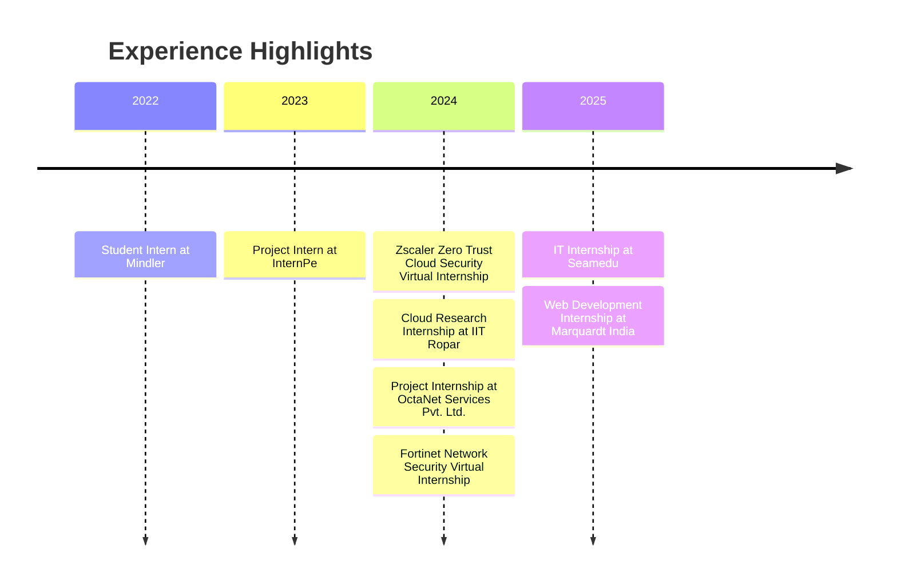
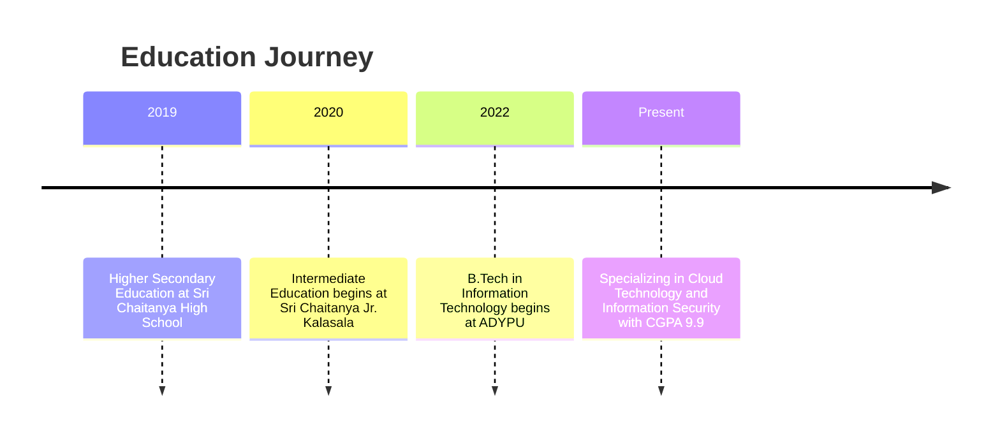
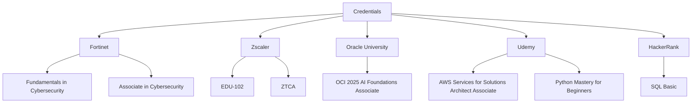
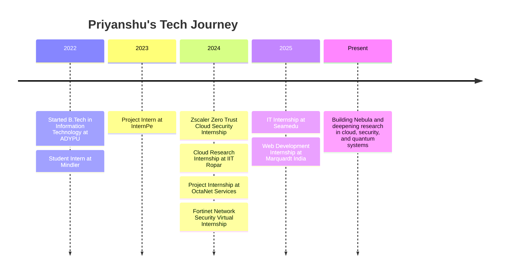

<h1 align="center">Priyanshu Kumar Sharma</h1>

  

  <strong>🎓 B.Tech Information Technology Student</strong> • <strong>☁️ Cloud Technology</strong> • <strong>🔒 Information Security</strong> • <strong>⚙️ Research-Driven Systems Builder</strong>

  
  
  
  
  
  
  
  
  
  
  

  
  

> I build secure cloud-native systems, explore multi-cloud orchestration, benchmark serverless platforms, and research how quantum computing can shape the future of infrastructure.

> I enjoy working on problems where architecture, security, and experimentation overlap, especially when the result is a system that is both practical today and future-facing tomorrow.

---

## Engineering in Four Directions

| Area                     | What I Do                                                                                                              |
| ------------------------ | ---------------------------------------------------------------------------------------------------------------------- |
| **Cloud Systems**        | Design scalable systems across AWS, Azure, and GCP with a strong interest in serverless and multi-cloud orchestration. |
| **Security Engineering** | Study IAM, AAA, Zero Trust, and secure access models for modern distributed environments.                              |
| **Research Thinking**    | Approach projects with benchmarking, experimentation, and architecture-level reasoning.                                |
| **Builder Mindset**      | Turn ideas into working repositories, guides, prototypes, and systems people can actually use.                         |

---

## Snapshot

- Final-year **B.Tech Information Technology** student specializing in **Cloud Technology and Information Security**.
- Research experience at **IIT Ropar** under the **Indian Academy of Sciences Summer Research Fellowship Program (2024)**.
- Hands-on with **AWS, Azure, GCP, Docker, Kubernetes, Terraform, Linux, IAM, and Zero Trust concepts**.
- Exploring the intersection of **serverless systems, cybersecurity, cloud architecture, and hybrid quantum-cloud computing**.
- Built a growing stack of **8 certifications and credentials** spanning cybersecurity, cloud, AI, SQL, and developer learning.
- Open-source contributor who enjoys building developer-first tools, educational resources, and infrastructure-focused projects.

---

## Current Radar

| Now Building                                              | Now Researching                                              | Long-Term Direction                                              |
| --------------------------------------------------------- | ------------------------------------------------------------ | ---------------------------------------------------------------- |
| **Nebula**, an API-first multi-cloud command center       | **Hybrid quantum-cloud systems** for security and efficiency | Becoming a cloud architect and security-focused systems engineer |
| Serverless benchmarking workflows and infra experiments   | Secure identity and access models in distributed systems     | Publishing research-backed engineering work                      |
| Portfolio-grade products with strong architecture stories | Practical cloud performance optimization                     | Building resilient platforms that scale cleanly                  |

---

## Flagship Work

### 1. Nebula: The Multi-Cloud Command Center

**Nebula** is an API-first orchestration engine designed to unify AWS, Azure, and GCP behind a single control plane. The vision is to simplify fragmented multi-cloud operations while making provisioning, observability, and intelligence more cohesive.

- Building toward a centralized orchestration layer for multi-cloud environments.
- Authoring research around the architecture, including the **Nebula AI Copilot** and **Async Provisioning Engine**.
- Focused on abstraction, scalability, and developer ergonomics.

**Repository:** [Nebula Multi-Cloud](https://github.com/PriyanshuKSharma/multi-cloud)

### 2. XFBench and XFaaS Development at IIT Ropar

During my research internship at **IIT Ropar**, I worked on systems that improve flexibility and benchmarking in serverless environments.

- Implemented and explored **XFBench** and **XFaaS** for serverless workload testing.
- Conducted performance assessment and optimization studies around cloud workflows.
- Contributed deployment notes and performance documentation for reproducible experimentation.

**Repositories:** [XFBench](https://github.com/PriyanshuKSharma/serverless-faas-workbench_IIT_Rpr.git) • [XFaaS](https://github.com/PriyanshuKSharma/XFaaS-IIT_Rpr.git) • [AWS Lambda Addition Module](https://github.com/PriyanshuKSharma/aws-lambda-addition.git)

### 3. Quantum Computing and Cloud Storage

This research explores how **quantum computing** can strengthen the future of cloud storage through hybrid architectures that improve security and operational design.

- Investigated hybrid cloud-quantum systems using **AWS**, **Docker**, and **IBM Quantum Experience**.
- Focused on the impact of quantum computing on storage systems and cloud security models.
- Documented findings in the paper **"Potential Impact of Quantum Computing on Cloud Storage: Hybrid Cloud-Quantum Systems."**

**Repository:** [Quantum Cloud Integration](https://github.com/PriyanshuKSharma/quantum-cloud-integration)

### 4. Identity and Access Management Research

Security is one of the foundations of my work, especially the challenge of giving systems the right access at the right time with minimal friction and maximum control.

- Studied **EAP, PAP, RADIUS, TACACS+, Kerberos, OAuth, and OpenID**.
- Explored **DAC, MAC, RBAC, and ABAC** access-control models.
- Applied the **AAA framework** to understand secure authentication and authorization in distributed networks.

---

## Selected Projects

| Project                                     | What It Focuses On                                                                                                                                                                                 | Links                                                                                                             |
| ------------------------------------------- | -------------------------------------------------------------------------------------------------------------------------------------------------------------------------------------------------- | ----------------------------------------------------------------------------------------------------------------- |
| **Multi-Cloud SaaS Orchestration Platform** | Cloud-native orchestration platform across AWS, Azure, and GCP with Dockerized microservices, Terraform provisioning, Celery jobs, Redis sync workflows, JWT auth, and a scalable FastAPI backend. | [GitHub](https://github.com/PriyanshuKSharma/multi-cloud)                                                         |
| **Storage SaaS Platform**                   | AI-powered video and business workflow SaaS built with Next.js 14, Tailwind CSS, Clerk authentication, Prisma, Neon DB, Cloudinary, and Vercel deployment.                                         | [GitHub](https://github.com/PriyanshuKSharma/media-storage-saas.git)                                              |
| **Quantum Cloud Integration**               | Hybrid cloud-quantum architecture connecting classical cloud infrastructure with IBM Quantum resources using AWS, Docker, and Python for secure, scalable experimentation.                         | [GitHub](https://github.com/PriyanshuKSharma/quantum-cloud-integration.git)                                       |
| **Rural Gyan Platform**                     | Full-stack educational platform with role-based dashboards, bilingual support, AI-assisted features, JWT auth, Docker deployment, and a React plus Node.js stack.                                  | [GitHub](https://github.com/PriyanshuKSharma/rural-gyan-paltform)                                                 |
| **XAI Interpret**                           | Explainable AI platform using SHAP and LIME to deliver interactive model interpretability, visual insights, and cloud-ready ML workflows for high-stakes use cases.                                | [GitHub](https://github.com/PriyanshuKSharma/xai_explainaibility)                                                 |
| **SkyVault**                                | Personal cloud storage system with Dockerized deployment, secure file management workflows, and a clean interactive interface for uploads, listings, and downloads.                                | [GitHub](https://github.com/PriyanshuKSharma/SkyVault.git) • [Demo](https://priyanshuksharma.github.io/SkyVault/) |
| **Ecobizz E-commerce App**                  | Cross-platform Flutter application for sustainable commerce, designed for Android and iOS with a product-focused mobile experience.                                                                | [GitHub](https://github.com/PriyanshuKSharma/EcoBizz-Sustainably-Yours---GDSC-Solution-Challenge-2024.git)        |

---

## Experience Highlights

```mermaid
timeline
    title Experience Highlights
    2022 : Student Intern at Mindler
    2023 : Project Intern at InternPe
    2024 : Zscaler Zero Trust Cloud Security Virtual Internship
         : Cloud Research Internship at IIT Ropar
         : Project Internship at OctaNet Services Pvt. Ltd.
         : Fortinet Network Security Virtual Internship
    2025 : IT Internship at Seamedu
         : Web Development Internship at Marquardt India
```

| Timeline                | Role                                             | Organization               | Focus                                                                       |
| ----------------------- | ------------------------------------------------ | -------------------------- | --------------------------------------------------------------------------- |
| **Jun 2025 - Sep 2025** | Web Development Intern                           | Marquardt India            | Full-stack development, UI/UX improvement, and feature implementation       |
| **Mar 2025 - Jun 2025** | IT Intern                                        | Seamedu                    | Coordination, operations, documentation, and process support                |
| **Jul 2024 - Sep 2024** | Fortinet Network Security Virtual Intern         | EduSkills                  | Cyber threat analysis, security protocols, and network defense fundamentals |
| **Jul 2024 - Aug 2024** | Project Intern                                   | OctaNet Services Pvt. Ltd. | Frontend web development and practical project delivery                     |
| **May 2024 - Jul 2024** | Cloud Research Intern                            | IIT Ropar                  | Serverless benchmarking, cloud research, and infrastructure experimentation |
| **Apr 2024 - Jun 2024** | Zscaler Zero Trust Cloud Security Virtual Intern | EduSkills                  | Zero Trust architecture and cloud security workflows                        |
| **Apr 2023 - May 2023** | Project Intern                                   | InternPe                   | Web development tasks and project implementation                            |
| **Nov 2022 - Dec 2022** | Student Intern                                   | Mindler                    | Communication, presentation, and early professional exposure                |

---

## Education

```mermaid
timeline
    title Education Journey
    2019 : Higher Secondary Education at Sri Chaitanya High School
    2020 : Intermediate Education begins at Sri Chaitanya Jr. Kalasala
    2022 : B.Tech in Information Technology begins at ADYPU
    Present : Specializing in Cloud Technology and Information Security with CGPA 9.9
```

| Degree / Stage                       | Institution                           | Timeline            | Highlight                                                                 |
| ------------------------------------ | ------------------------------------- | ------------------- | ------------------------------------------------------------------------- |
| **B.Tech in Information Technology** | Ajeenkya D Y Patil University, Pune   | Aug 2022 - Present  | Specialization in Cloud Technology and Information Security,**CGPA: 9.9** |
| **Intermediate Education (11th and 12th)**           | Sri Chaitanya Jr. Kalasala, Hyderabad | Apr 2020 - May 2022 | Science and Mathematics,**93.9%**                                         |
| **Higher Secondary Education (10th)**       | Sri Chaitanya High School, Hyderabad  | Apr 2019 - May 2020 | Completed higher secondary education,**87.6%**                            |

---

## Technical Arsenal

**Languages**

  
  
  
  
  

Java • Python • JavaScript • Dart • Bash

**Web and App Development**

  
  
  
  
  
  

HTML5 • CSS3 • React • Django • Flutter • Tailwind CSS

**Cloud, Serverless, and Infrastructure**

  
  
  
  
  
  
  
  

AWS • Azure • GCP • AWS Lambda • OpenFaaS • Cloudflare • Terraform • Pulumi

**Security and Systems**

  
  
  
  
  
  
  

IAM • Zero Trust • Network Security • Linux • Docker • Kubernetes • Nmap

**Data, DevOps, and Storage**

  
  
  
  
  
  

Redis • MySQL • Amazon S3 • GitHub • GitLab • Neon

**Exploring Next**

  
  

IBM Quantum • AWS Braket

```mermaid
flowchart TD
    A[Technical Arsenal] --> B[Languages]
    A --> C[Web and App]
    A --> D[Cloud and Infrastructure]
    A --> E[Security and Systems]
    A --> F[Research]
    B --> B1[Java]
    B --> B2[Python]
    B --> B3[JavaScript]
    B --> B4[Dart]
    B --> B5[Bash]
    C --> C1[HTML5]
    C --> C2[CSS3]
    C --> C3[React]
    C --> C4[Django]
    C --> C5[Flutter]
    C --> C6[Tailwind CSS]
    D --> D1[AWS]
    D --> D2[Azure]
    D --> D3[GCP]
    D --> D4[Docker]
    D --> D5[Kubernetes]
    D --> D6[Terraform]
    D --> D7[Pulumi]
    E --> E1[IAM]
    E --> E2[Zero Trust]
    E --> E3[Network Security]
    E --> E4[Nmap]
    F --> F1[IBM Quantum]
    F --> F2[AWS Braket]
```

---

## Certifications and Credentials

A blend of vendor certifications, technical credentials, and focused course-based learning across cybersecurity, cloud, AI, and core developer skills.

```mermaid
flowchart TD
    A[Credentials] --> B[Fortinet]
    A --> C[Zscaler]
    A --> D[Oracle University]
    A --> E[Udemy]
    A --> F[HackerRank]
    B --> B1[Fundamentals in Cybersecurity]
    B --> B2[Associate in Cybersecurity]
    C --> C1[EDU-102]
    C --> C2[ZTCA]
    D --> D1[OCI 2025 AI Foundations Associate]
    E --> E1[AWS Services for Solutions Architect Associate]
    E --> E2[Python Mastery for Beginners]
    F --> F1[SQL Basic]
```

| Credential                                                              | Provider          | Type                       |
| ----------------------------------------------------------------------- | ----------------- | -------------------------- |
| **Fortinet Certified Fundamentals in Cybersecurity**                    | Fortinet          | Vendor certification       |
| **Fortinet Certified Associate in Cybersecurity**                       | Fortinet          | Vendor certification       |
| **Fundamentals of Cybersecurity (EDU-102)**                             | Zscaler           | Security credential        |
| **Zero Trust Certified Associate (ZTCA)**                               | Zscaler           | Vendor certification       |
| **Oracle Cloud Infrastructure 2025 Certified AI Foundations Associate** | Oracle University | Cloud and AI certification |
| **AWS Services for Solutions Architect Associate - Udemy**              | Udemy             | Course certificate         |
| **SQL (Basic)**                                                         | HackerRank        | Skill credential           |
| **Python Mastery for Beginners**                                        | Udemy             | Course certificate         |

### Virtual Internships

- **Zscaler Zero Trust Cloud Security Virtual Internship** — EduSkills Foundation, Apr 2024 to Jun 2024
- **Fortinet Network Security Virtual Internship** — AICTE EduSkills, Jul 2024 to Sep 2024

---

## Open Source and Community

- Contributed to **[Interns-MQI-25](https://github.com/Interns-MQI-25)** and its **[project-interns](https://github.com/Interns-MQI-25/project-interns)** repository.
- Worked in collaborative environments around **Docker, Cloud, and DevOps**.
- Enjoy sharing what I learn through code, documentation, experiments, and student-friendly guides.

  

---

## Timeline

```mermaid
timeline
    title Priyanshu's Tech Journey
    2022 : Started B.Tech in Information Technology at ADYPU
         : Student Intern at Mindler
    2023 : Project Intern at InternPe
    2024 : Zscaler Zero Trust Cloud Security Internship
         : Cloud Research Internship at IIT Ropar
         : Project Internship at OctaNet Services
         : Fortinet Network Security Virtual Internship
    2025 : IT Internship at Seamedu
         : Web Development Internship at Marquardt India
    Present : Building Nebula and deepening research in cloud, security, and quantum systems
```

---

## Learning Lab

<strong>Guides, manuals, and side builds</strong>

- **Ubuntu Linux Installation Manual** — A practical guide for installing and configuring Ubuntu on VirtualBox.
- **Shell Scripting for Beginners** — Introductory scripting guide covering permissions, services, text manipulation, and beginner automation tasks.
- **Win-KeX for Kali Linux on WSL 2** — Planned setup guide for bringing a graphical Kali Linux workflow to Windows.
- **Java Swing Online Test Application** — Planned desktop application with timer-based test flow and score calculation.
- **Fit Raho Gym Website** — Interactive website project built with HTML, CSS, and JavaScript.

---

## Fun Facts

| Signal                                      | What It Usually Means                                                                      |
| ------------------------------------------- | ------------------------------------------------------------------------------------------ |
| `terminal open, architecture sketch nearby` | I am probably turning a research idea into a working system.                               |
| `IAM policy on screen`                      | I have entered puzzle-solving mode and will stay there until the access model makes sense. |
| `benchmark notes everywhere`                | Curiosity has become experimentation, and experimentation is becoming engineering.         |
| `IBM Quantum and cloud docs both open`      | I am exploring how future infrastructure could connect classical and quantum systems.      |
| `a repetitive task annoys me twice`         | It is one script away from being automated.                                                |
| `new repo appears suddenly`                 | A side idea just got promoted into a prototype.                                            |

---

## GitHub Snapshot

  

  
  

  

---

## What I Am Aiming For

- Build **Nebula** into a serious multi-cloud orchestration platform.
- Publish research on **quantum-cloud systems**, **IAM**, and **multi-cloud architecture**.
- Contribute to **open-source security and cloud tooling** that helps developers build faster and safer.
- Keep growing into a role where I can design platforms that are secure, elegant, and genuinely useful.

---

## Connect With Me

  
  
  
  
  

---

  <strong>Thanks for stopping by.</strong> 
  If you are building in cloud, security, research, or modern infrastructure, I would be glad to connect and collaborate.

