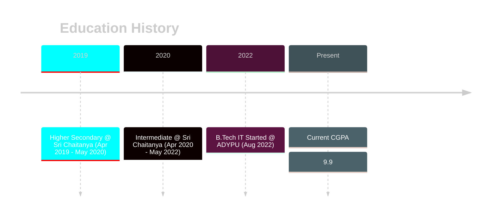
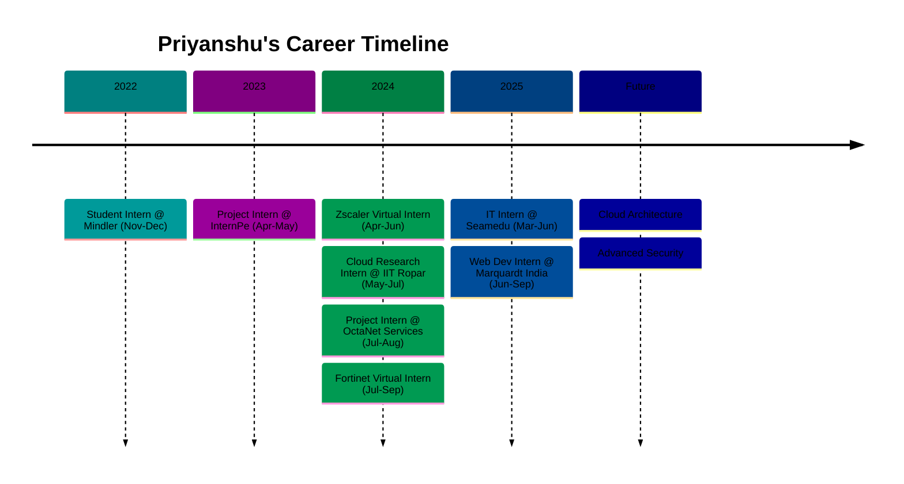

# 👨💻 Priyanshu Kumar Sharma | B.Tech IT Student | Cloud Technology & Information Security

Hello! I'm **Priyanshu Kumar Sharma**, a fourth-year **B.Tech** student specializing in **Information Technology** with a deep passion for **Cloud Computing**, **Cybersecurity**, **Machine Learning** and **Quantum Computing**. I enjoy exploring new frameworks, expanding my expertise in serverless and cloud infrastructures, and advancing in areas like **Identity and Access Management (IAM)**, **Hybrid Quantum-Cloud Systems**, and **Zero Trust Security**.

I embrace a project-based learning approach and have accumulated hands-on experience in research, open-source projects, and security solutions. This README summarizes my experiences, certifications, and projects, highlighting my journey and ambitions in technology.

 

---

## 🚀 Summary

- **🎓 B.Tech IT (4th Year)** student focused on Cybersecurity and Cloud Computing.
- **🔐 InfoSec Enthusiast**: Hands-on experience in Zero Trust, IAM, and network security.
- **☁️ Cloud and Quantum Computing**: Actively researching Hybrid Quantum-Cloud Systems and practical applications of quantum computing.
- **💼 Ex- Research Intern at IIT Ropar**: Working on XFBench and XFaaS development in a cutting-edge research setting.
- **📈 Open-Source Contributor**: Contributing tools, scripts, and resources for the tech community.

---

## 🔬 Research Projects & Internships

### 1. **XFBench and XFaaS Development - Research Intern at IIT Ropar**

- **Position**: Research Intern | **Program**: Summer Research Fellowship Program, Indian Academy of Sciences (2024)
- **Description**: As a research intern at **IIT Ropar**, I am contributing to XFBench and XFaaS—tools that enhance benchmarking and flexibility in serverless architectures. My work involves analyzing and optimizing cloud-based workflows and infrastructures.
- **Responsibilities**:
  - Implementing **XFBench** and **XFaaS** for serverless workload testing.
  - Conducting performance assessments and data-driven optimizations.
  - Documenting deployment and performance insights for XFBench.
- **Repositories**:
  - [Serverless Workbench - XFBench](https://github.com/PriyanshuKSharma/serverless-faas-workbench_IIT_Rpr.git)
  - [XFaaS Framework](https://github.com/PriyanshuKSharma/XFaaS-IIT_Rpr.git)
  - [AWS Lambda Addition Module](https://github.com/PriyanshuKSharma/aws-lambda-addition.git)

### 2. **Quantum Computing and Cloud Storage: Hybrid Cloud-Quantum Systems**

- **Project**: Research on integrating **Quantum Computing** within cloud storage to enhance data security and operational efficiency.
- **Objective**: To explore the **impact of quantum computing** on data storage and develop hybrid systems on **AWS**, **GitHub**, and **IBM Quantum**.
- **Implementation Details**:
  - Establishing **hybrid cloud systems** with quantum applications using **Docker**, **AWS Lambda**, and **IBM Quantum Experience**.
  - Documenting and presenting findings in a research paper titled **"Potential Impact of Quantum Computing on Cloud Storage: Hybrid Cloud-Quantum Systems"**.
- **GitHub Repository**: [Quantum Cloud Integration](https://github.com/PriyanshuKSharma/quantum-cloud-integration)

### 3. **Identity and Access Management (IAM) - Security Research**

- **Focus**: Understanding and implementing IAM for organizational security.
- **Topics Covered**:
  - Authentication protocols: **EAP, PAP, RADIUS, TACACS+, Kerberos, OAuth, OpenID**.
  - Access control models: **DAC, MAC, RBAC, ABAC**.
  - Implementing the **AAA framework** for improved security in distributed networks.
- **Outcome**: Practical understanding of IAM policies and their implementation in secure networks.

---

## 📜 Certifications & Virtual Internships

### 1. **Zscaler Zero Trust Cloud Security Internship**

- **Organized by**: EduSkills Foundation (April 2024 - June 2024)
- **Skills Gained**:
  - **Zero Trust** architecture design and device access management.
  - Labs and simulations covering identity and security in cloud infrastructures.

### 2. **Fortinet Network Security Associate - AICTE Eduskills**

- **Certification**: **Introduction to the Threat Landscape 2.0**
- **Focus**: Cyber threat analysis, network vulnerability detection, and security protocols.

---

## 💻 Open-Source Projects & Repositories

### 1. **Linux Practicals**

- **Repository**: [Linux Practicals Repository](https://github.com/PriyanshuKSharma/Linux-Practicals)
- **Description**: Hands-on exercises on Linux covering scripting, file management, and system administration basics, created for students and Linux enthusiasts.

### 2. **Win-KeX for Kali Linux on WSL 2 - Setup Guide**

- **Repository (Planned)**: A guide for setting up **Win-KeX** on **Kali Linux for Windows Subsystem for Linux (WSL 2)**.
- **Goal**: Steps and configurations for a graphical interface on Kali Linux, easing setup for security testing and labs.

### 3. **Java Swing Online Test Application**

- **Repository (Planned)**: Java Swing-based application for an online test environment.
- **Features**:
  - User-friendly GUI for administering tests.
  - Integrated timer and score calculation.

---

## 📘 Lab Manuals & Educational Guides

1. **Ubuntu Linux Installation Manual**

   - A comprehensive guide on installing and configuring **Ubuntu Linux on VirtualBox**. Covers setup, installation, and optimization tips for performance.

2. **Shell Scripting for Beginners**

   - Guide on **shell scripting basics** with examples of **file permissions**, **system service management**, and scripting tasks.
   - Example scripts for **text manipulation** in files, displaying **days of the week** in reverse, and setting permissions.

3. **Fit Raho Gym Website**

   - Developed an interactive website for **Fit Raho Gym** using **HTML, CSS, and JavaScript** with sections like **About Us**, background images, and buttons for user engagement.

---

## 🛠️ Technical Skills

### Programming Languages

  
  
  

---

### Web/App Development

  
  
  
  

---

### Serverless & Cloud Computing

  
  
  
  

---

### Cybersecurity

  
  
  

---

### Virtualization & Docker

  
  
  
  

---

### Quantum Computing

  

---

### DevOps

  
  

---

### Infrastructure as Code

  

---

### Database & Storage

  
  
  

---

## 🌐 Open Source Contribution

### 🔹 Organization: [Interns-MQI-25](https://github.com/Interns-MQI-25)

- Contributed to: [project-interns](https://github.com/Interns-MQI-25/project-interns)
- Focus: **Docker, Cloud, and DevOps**
- Collaboration with peers to build impactful **industry-level projects**

---

## 💻 Notable Projects

- 🌩️ [**Media Storage SaaS**](https://github.com/PriyanshuKSharma/media-storage-saas) – A scalable cloud-based storage SaaS.
- ⚛️ [**Quantum-Cloud Integration**](https://github.com/PriyanshuKSharma/quantum-cloud-integration) – Hybrid Quantum-Cloud system with AWS & IBM Q.
- ☁️ [**SkyVault**](https://github.com/PriyanshuKSharma/SkyVault) – Personal cloud platform with Docker & interactive frontend.
- 🌱 [**EcoBizz: Sustainably Yours**](https://github.com/PriyanshuKSharma/EcoBizz-Sustainably-Yours---GDSC-Solution-Challenge-2024) – GDSC 2024 Solution Challenge project for sustainability.

---

## 🎓 Education

  

    <h3>Academic Background</h3>
    <table width="90%" align="center" style="border: none;">
      <tr>
        <td align="right" width="180px" valign="top"><b>Aug 2022 – Present 🏫</b></td>
        <td><b>Bachelor of Technology in Information Technology</b> Ajeenkya D Y Patil University, Pune <i>Specializing in Cloud Technology and Information Security. Active in hackathons and cybersecurity clubs. Current CGPA: 9.9</i></td>
      </tr>
      <tr><td colspan="2" height="10"></td></tr>
      <tr>
        <td align="right" width="180px" valign="top"><b>Apr 2020 – May 2022 🎓</b></td>
        <td><b>Intermediate Education</b> Sri Chaitanya Jr. Kalasala, Hyderabad <i>Focusing on Science and Mathematics. Grade: 93.9%</i></td>
      </tr>
      <tr><td colspan="2" height="10"></td></tr>
      <tr>
        <td align="right" width="180px" valign="top"><b>Apr 2019 – May 2020 🏫</b></td>
        <td><b>Higher Secondary Education</b> Sri Chaitanya High School, Hyderabad <i>Completed higher secondary education. Grade: 87.6%</i></td>
      </tr>
    </table>
  

---

## 📅 My Tech Journey

    <h3>Professional Timeline</h3>
    <table width="90%" align="center" style="border: none;">
      <tr>
        <td align="right" width="180px" valign="top"><b>June 2025 – Sep 2025 💼</b></td>
        <td><b>Web Development Intern @ Marquardt India</b> Full-stack development, UI/UX optimization, and feature implementation using MERN stack. <i>Skills: JavaScript, React.js, Tailwind CSS, HTML5, SQL Server</i></td>
      </tr>
      <tr><td colspan="2" height="10"></td></tr>
      <tr>
        <td align="right" width="180px" valign="top"><b>Mar 2025 – Jun 2025 🎓</b></td>
        <td><b>IT Intern @ Seamedu</b> Student & employer coordination, placement drive management, and documentation. <i>Skills: Strategic Planning, Student Services</i></td>
      </tr>
      <tr><td colspan="2" height="10"></td></tr>
      <tr>
        <td align="right" width="180px" valign="top"><b>Jul 2024 – Sep 2024 🛡️</b></td>
        <td><b>Fortinet Network Security Virtual Intern @ EduSkills</b> Cyber threat analysis, network vulnerability detection, and security protocols. <i>Skills: Red Hat Linux, Network Security</i></td>
      </tr>
      <tr><td colspan="2" height="10"></td></tr>
      <tr>
        <td align="right" width="180px" valign="top"><b>Jul 2024 – Aug 2024 💻</b></td>
        <td><b>Project Intern @ OctaNet Services Pvt Ltd.</b> Web development projects focusing on frontend technologies. <i>Skills: HTML5, CSS, Programming</i></td>
      </tr>
      <tr><td colspan="2" height="10"></td></tr>
      <tr>
        <td align="right" width="180px" valign="top"><b>May 2024 – Jul 2024 🔬</b></td>
        <td><b>Cloud Research Intern @ IIT Ropar</b> Serverless architecture research, XFBench implementation, and performance benchmarking. <i>Skills: AWS, Cloud Computing, DevOps, Research</i></td>
      </tr>
      <tr><td colspan="2" height="10"></td></tr>
      <tr>
        <td align="right" width="180px" valign="top"><b>Apr 2024 – Jun 2024 ☁️</b></td>
        <td><b>Zscaler Zero Trust Cloud Security Virtual Intern</b> Zero Trust architecture design and cloud security implementation. <i>Skills: Zscaler Zero Trust Exchange, Cloud Security</i></td>
      </tr>
      <tr><td colspan="2" height="10"></td></tr>
      <tr>
        <td align="right" width="180px" valign="top"><b>Apr 2023 – May 2023 🌐</b></td>
        <td><b>Project Intern @ InternPe</b> Web development tasks and project implementation. <i>Skills: Web Development</i></td>
      </tr>
      <tr><td colspan="2" height="10"></td></tr>
      <tr>
        <td align="right" width="180px" valign="top"><b>Nov 2022 – Dec 2022 🎓</b></td>
        <td><b>Student Intern @ Mindler</b> Gained insights into career counseling and organizational operations. <i>Skills: Presentation, Communication</i></td>
      </tr>
    </table>
  

---

## ✨ Fun Facts

  

    <table width="90%" align="center">
      <tr>
        <td width="5%" align="right"></td>
        <td width="50%" align="left">I spend more time configuring IAM policies than I do sleeping.</td>
      </tr>
      <tr><td colspan="2" height="10"></td></tr>
      <tr>
        <td width="5%" align="right"></td>
        <td width="50%" align="left">Exploring the quantum realm (literally, with IBM Quantum).</td>
      </tr>
      <tr><td colspan="2" height="10"></td></tr>
      <tr>
        <td width="5%" align="right"></td>
        <td width="50%" align="left">Linux enthusiast - I probably have a script for that.</td>
      </tr>
    </table>
  

---

## 📊 GitHub Stats

 

&nbsp;&nbsp;

 

---

## 🎯 Future Goals

- 🚀 Build **SkyVault: Personal Docker-based Cloud Storage**
- 📑 Publish research on **Quantum-Cloud Systems & IAM**
- 🔐 Contribute to **open-source InfoSec tools**

---

## 📫 Connect with Me

  
  
  
  
  

---

⭐ _Thank you for visiting my profile! Let's innovate and build the future together._
